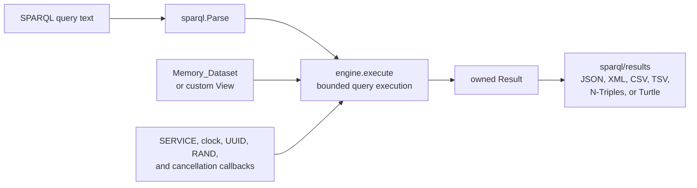

[](https://github.com/crapthings/odin-sparql/actions/workflows/ci.yml)
[](https://www.w3.org/TR/sparql11-query/)

[](LICENSE)

# odin-sparql

A bounded, dataset-agnostic implementation of the SPARQL 1.1 Query Language
for Odin, built on [`odin-rdf`](../odin-rdf). Parse and execute queries over
application-owned RDF data without making an RDF store, opening network
connections implicitly, or assuming an index layout.

Use `odin-sparql` for an embeddable SPARQL parser and query engine with
explicit resource limits, ownership rules, and integration callbacks. It is
not a graph store, HTTP client, SPARQL Protocol endpoint, entailment engine, or
SPARQL Update implementation.

**Start here:** [minimal in-memory example](examples/minimal/main.odin) ·
[application-owned custom View example](examples/custom_view/main.odin) ·
[public API overview](#public-api-overview) ·
[conformance policy](docs/conformance.md) · [roadmap](ROADMAP.md)

## Quick start

Public packages import `odin-rdf` through Odin's named collection support.
From this repository's root, point the collection at a sibling, vendored, or
otherwise application-owned `odin-rdf` checkout:

```sh
odin run examples/minimal -collection:odin-rdf=../odin-rdf
odin run examples/custom_view -collection:odin-rdf=../odin-rdf
```

The [minimal example](examples/minimal/main.odin) builds a sealed in-memory
dataset, parses and executes a query, and writes SPARQL Results JSON using
only intended public packages. The [custom View example](examples/custom_view/main.odin)
shows the same query path over application-owned storage through a graph-scoped
streaming `dataset.Scan_Proc`.

The minimal example prints:

```json
{"head":{"vars":["name"]},"results":{"bindings":[{"name":{"type":"literal","value":"Ada"}}]}}
```

## Status and scope

`odin-sparql` is pre-1.0. Milestones M0–M7 are complete and M8 is ongoing
hardening; a 1.0 API freeze remains a deliberate future decision. The
[roadmap](ROADMAP.md) reports implementation readiness, not published tags or
a claim of complete SPARQL 1.1 evaluation conformance.

| Area | Use it for | Important boundary |
| --- | --- | --- |
| Query syntax | The complete SPARQL 1.1 Query grammar and an owned, read-only source AST | The full syntax gate does not make a claim of complete query-evaluation conformance. SPARQL Update is separate future work. |
| Query execution | `SELECT`, `ASK`, `CONSTRUCT`, and the documented concise-policy `DESCRIBE`; BGPs, `OPTIONAL`, `UNION`, `MINUS`, `GRAPH`, `VALUES`, `FILTER`, `BIND`, subqueries, grouping/aggregates, property paths, expressions, and solution modifiers | Exact semantics, tested slices, exclusions, and the implementation-defined `DESCRIBE` policy live in the conformance and execution documents. |
| Datasets | A sealed in-memory Dataset or an application-owned `dataset.custom_view` adapter | `FROM` / `FROM NAMED` restrict graphs already exposed by the View; they never load resources. No storage backend is built in. |
| Integrations | Explicit callbacks for `SERVICE`, clocks, UUIDs, random values, and cooperative cancellation | The core never performs network I/O. Callers own transport, authentication, caching, and source policy. |
| Results | Owned results written as SPARQL Results JSON/XML/CSV/TSV or graph N-Triples/Turtle | Use the form-appropriate writer in `sparql/results`; result values remain valid after the query and Dataset are destroyed. |

The pinned SPARQL 1.1 Query syntax manifest passes all 63 positive and 31
negative entries. Evaluation capabilities are claimed only where their pinned
or local gates pass; see the [conformance policy](docs/conformance.md) for the
complete ledger and intentional exclusions.

SPARQL 1.1 is the normative baseline. SPARQL 1.2 remains out of scope until it
is a stable recommendation and `odin-rdf` has an intentional RDF 1.2 policy.

## Why odin-sparql?

- **Bounded by contract.** Execution uses explicit solution and numeric
  limits rather than hidden admission policies.
- **Storage remains yours.** Start with the sealed memory Dataset, or supply a
  graph-scoped streaming View over an application-owned snapshot or index.
- **Standards-led.** W3C fixtures are pinned and verified without a live
  network dependency; new claims require their own evidence.
- **No implicit network I/O.** `SERVICE` and external nondeterministic values
  enter only through caller-supplied callbacks.
- **Observable planning.** `engine.Options.Optimize_BGP` is an opt-in,
  deterministic triple-pattern ordering heuristic with caller-owned
  `engine.Execution_Statistics` counters.

## How it fits



The engine consumes a Dataset View and callback values but does not choose or
open a database, service, or network connection for the application.

## Public API overview

The intended stable surface is deliberately small. The linked API documents
are the source of truth for signatures, ownership, limits, and error behavior.

| Package | Main job | Read first |
| --- | --- | --- |
| `sparql` | Parse owned queries, inspect diagnostics, and traverse the read-only source AST | [Parser API](docs/public-parser-api.md) |
| `sparql/dataset` | Create sealed in-memory Datasets or expose an application-owned graph-scoped scan adapter | [Dataset API](docs/dataset-api.md) |
| `sparql/engine` | Execute a query with bounded options, callbacks, execution statistics, and owned results | [Query execution API](docs/query-execution-api.md) |
| `sparql/results` | Serialize SELECT/ASK and graph results in the supported standard formats | [Graph-result and serialization design](docs/m6-graph-results-design.md) |

`sparql/algebra`, `sparql/eval`, and `sparql/internal/...` are implementation
packages. Odin can import them, but they carry no source-compatibility promise;
applications should use the four packages above. See the
[compatibility policy](docs/compatibility.md) for the pre-1.0 contract.

## Documentation

| Need | Read |
| --- | --- |
| Exact W3C coverage, exclusions, and DESCRIBE policy | [Conformance policy](docs/conformance.md) |
| Ownership, errors, limits, and cancellation at the public boundary | [Parser API](docs/public-parser-api.md) · [Dataset API](docs/dataset-api.md) · [Query execution API](docs/query-execution-api.md) |
| Compatibility and release expectations | [Compatibility policy](docs/compatibility.md) · [Changelog](CHANGELOG.md) · [Release guide](docs/releasing.md) |
| Architecture, planning, and feature design | [Architecture](docs/architecture.md) · [query parser](docs/query-parser-design.md) · [Dataset/BGP](docs/dataset-and-bgp-design.md) · [expressions and modifiers](docs/m4-expression-and-modifier-design.md) · [SERVICE callbacks](docs/m7-service-callback-design.md) · [query planning](docs/m7-query-planning-design.md) |

## Repository layout

```text
sparql/                 Public parser, diagnostics, and AST traversal
sparql/dataset/         Dataset interfaces, ownership, and memory implementation
sparql/engine/          Bounded public query-execution API
sparql/results/         SPARQL Results and graph serialization
sparql/algebra/         Implementation algebra values and lowering
sparql/eval/            Implementation evaluator
sparql/internal/lexer/  SPARQL lexical layer
examples/minimal/       Public API end-to-end example
examples/custom_view/   Application-owned Dataset adapter example
tests/w3c/              Pinned W3C Query test runners and fixture guidance
tests/property/         Deterministic semantic properties
tests/fuzz/             Reproducible parser fuzzing harness
benchmarks/             Reproducible BGP-planning workloads
docs/                   Architecture, API, conformance, and release policy
```

## Verification

For a fast local check with a sibling `odin-rdf` checkout:

```sh
odin check sparql -no-entry-point -collection:odin-rdf=../odin-rdf
odin test sparql -collection:odin-rdf=../odin-rdf
odin test sparql/engine -collection:odin-rdf=../odin-rdf
odin run examples/minimal -collection:odin-rdf=../odin-rdf
odin run examples/custom_view -collection:odin-rdf=../odin-rdf
```

The full release gate adds strict checks, sanitizers, property/fuzz coverage,
and the pinned W3C suites. Follow the [release guide](docs/releasing.md), then
run `sh scripts/verify-release.sh`; it requires local `odin-rdf` and already
cached pinned W3C fixtures, and never downloads them during verification.

## Contributing and security

See [CONTRIBUTING.md](CONTRIBUTING.md) for test and semantic-evidence
requirements. To report a vulnerability, follow the [security policy](SECURITY.md).

## License

`odin-sparql` is available under the [MIT License](LICENSE).
